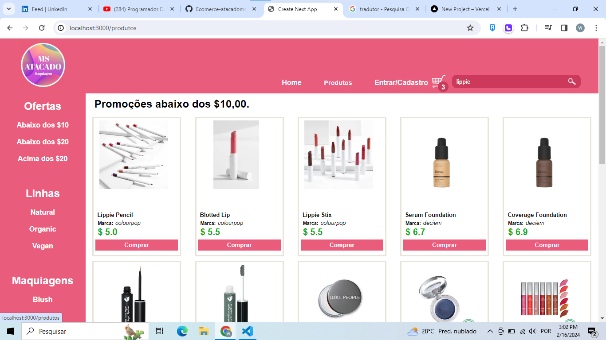
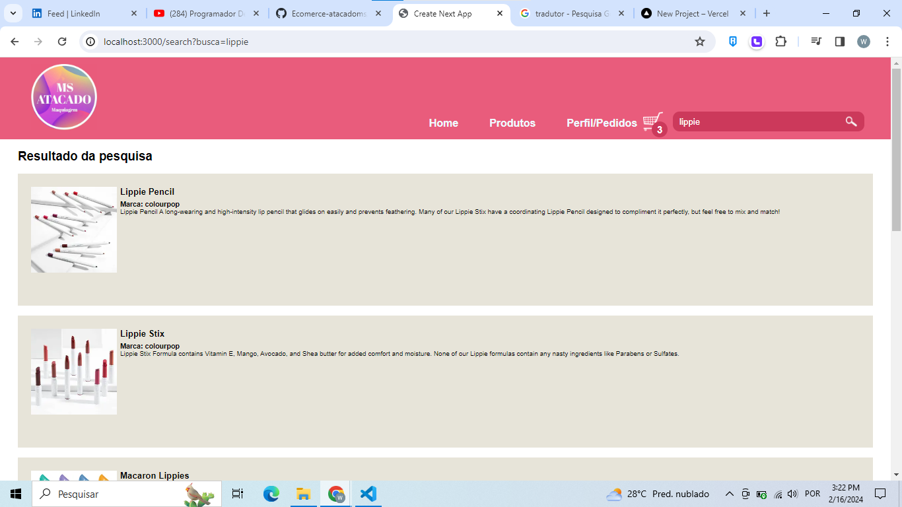
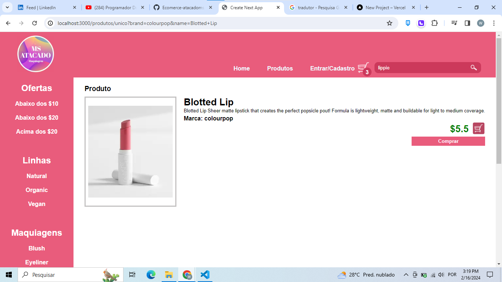
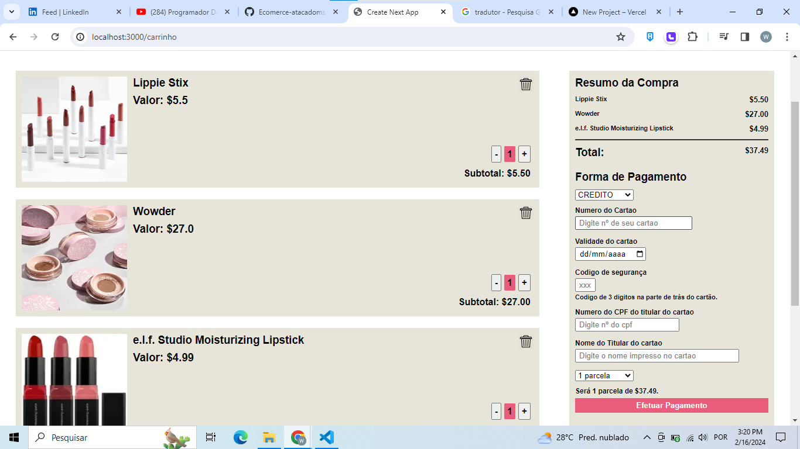
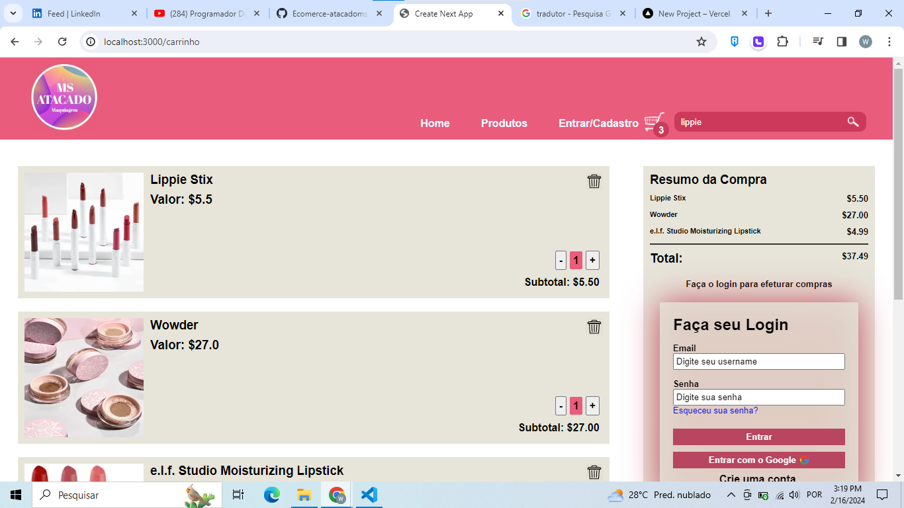
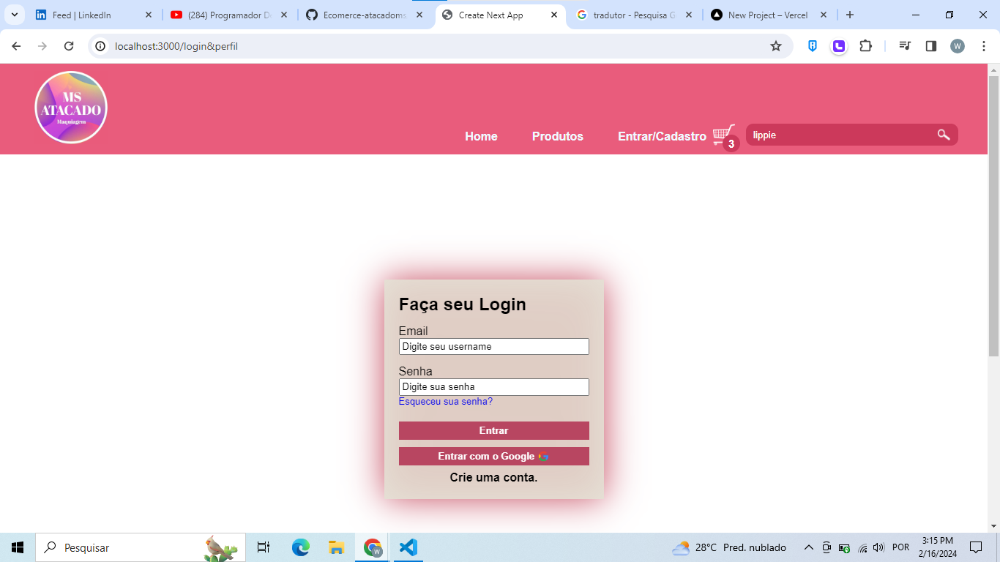
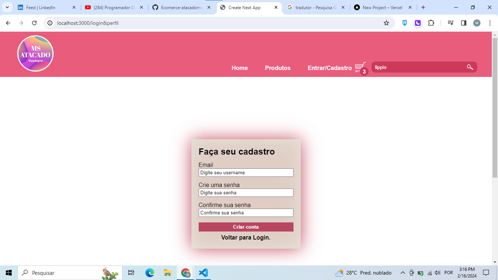
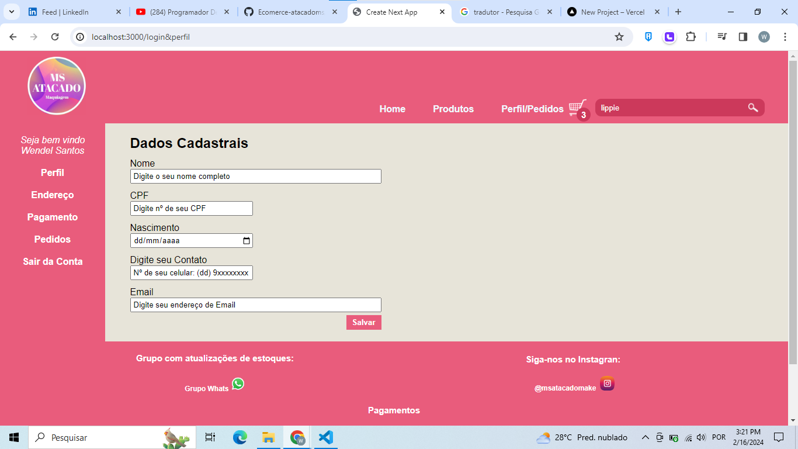

## Descrição do Projeto

E-commerce de Maquiagens desenvolvido como proposta para empresa MS Atacados, para um site de vendas de seus produtos,
logo possuo autorização de utilização da logo e tudo que compete os direitos autorais da empresa. Todo projeto foi 
desenvolvido com React, Next.js e TypeScript. Vale ressaltar que a princípio apenas o FrontEnd do site foi concretizado,
sendo incrementado apenas a validação de login e cadastro de usuário junto ao Firebase. O BackEnd do projeto, que consiste
em criação do banco de dados para cadastro dos dados do usuário e cadastro de pedidos, ainda será desenvolvido, afim de criar 
um sistema robusto e pronto para utilização da empresa. Até então, o projeto é o carro chefe do meu portifólio FrontEnd. 
Foi utilizado uma API pública e gratuita de maquiagens como mostuário para melhor vizualização do layout do site.
Projeto aberto a críticas, elogios e sugestões de melhorias.

## Funcionalidades

- Aba produtos com listagem das três categorias de produtos fornecidos pela Api: 
    

     
    
 

- Componente Search para pesquisa de algum produto que possa estar na API pública:
   

    
   
 

- Aba de Produto individual, com descrições do produto, além de opções de adiciona-lo ao carrinho ou comprar indo direto para a page de compras:
   

    
   
 

- Page de carrinhos com produtos que o usuário adicionou durante a busca, com opções de adicionar ou diminuir quantidades e  excluir o produto da lista de compras. Além disso a aba de pagamentos que caso o usuario esteja logado ele poderá escolher formas de pagamentos,(Pagamento ainda não disponível pois essa parte do sistema ainda não foi desenvolvida) caso não esteja logado será solicitado para que ele efetue o login :
   

    
    
   
 

- Página de login, com validação feita com o Firebase, podendo se logar via conta Google. Além disso, página de cadastro para efetuar login e ter acesso a uma conta pessoal na aplicação com toda validação sendo feito via Firebase:
   

    
    
   
 

- Page do perfil do cliente contendo os dados pessoais, informações de endereço, dados de pagamentos e histórico de pedidos. Porém, como já mencionado esssa parte da aplicação ainda será desenvolvida, com a criação de um banco de dados para gerenciar com segurança as informações passadas pelos usuários:
   

    
   
 

## Deploy na Vercel

- Navegue pela aplicação https://ecomerce-atacadoms.vercel.app/